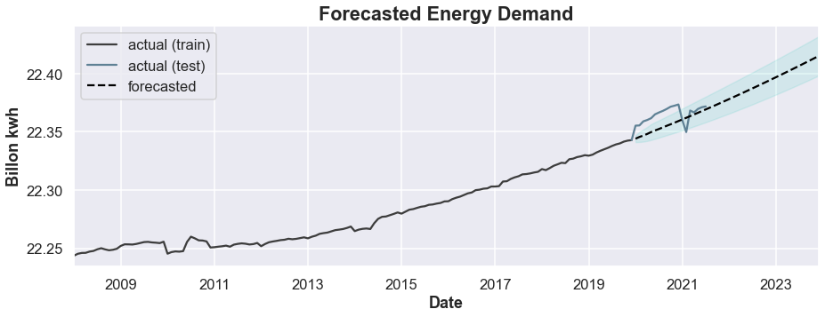
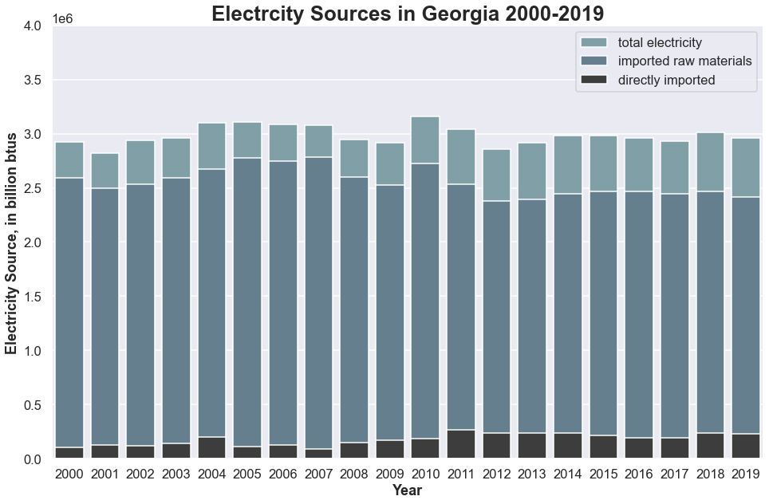
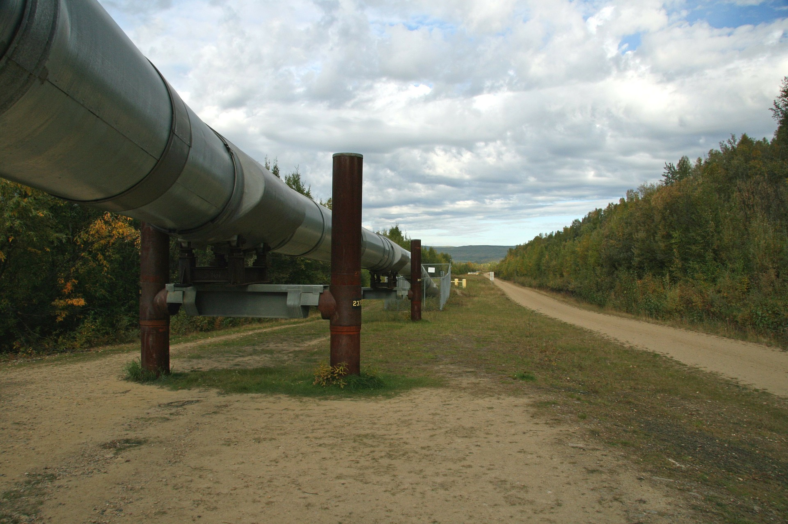
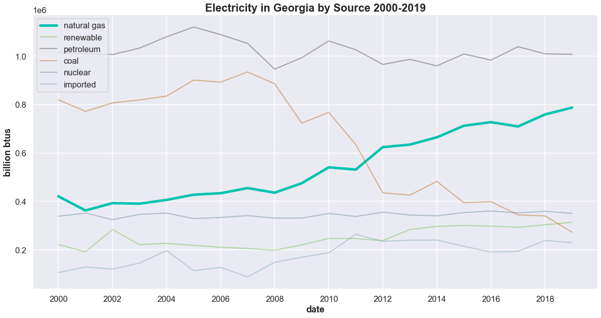

# Scrap the Solar Cap: Why lifting Georgia Power’s net metering cap benefits the state

## Understanding the Problem
***

GA Power is the largest power utility in Georgia, serving over 2.3 million residential customers. A net-metering program was initiated in 2019 that allowed customers with photovoltaic (PV) solar panels on their roof to sell excess electricity to GA Power at competitive rates. **The cap of 5,000 customers for the program was recently reached, disincentivizing customers from installing solar power on their homes.**

## Business Value
***

Eliminating the net metering cap will incentivize more Georgia residents to install PV panels on their homes because they will be able to sell back their excess electricity at competitive market rates, thus decreasing the time it takes for the system to pay for itself. **Increasing the number of homes with PV solar panels will benefit the residents of Georgia by helping to moderate energy prices and limit demand on the grid. Furthermore, an increase in residential PV systems will position the state to be more resilient in the face of a changing energy landscape and will ensure that Georgia remains competitive in the U.S. energy market.**

## Methodology
***

**Data from the U.S. Energy Administration (EIA) were used to analyze the trends and forecast future changes** in Georgia’s residential power demand, natural gas prices and residential solar generation. In addition, the relationship between extreme temperatures and demand on the electrical grid was investigated.

## Benefit 1: Reduce Dependence on Imported Electricity
***

### Data Preparation

In order to estimate and forecast the residential power demand for Georgia, I used the average usage of 1,138 kwh/GA residence (from chooseenergy.com) along with the monthly change in residential customers from EIA.gov. 

The data show a clear positive trend and even after taking the log of the differences, the data were not stationary (Dickey-Fuller test has a p-value of 0.13). The model was trained on 12 years of data and evaluated on just under 2 years. 

### Modeling

The ACF and PACF plots showed a significant lag of 5, indicating that the demand 5 months ago can be used to predict demand today. A simple SARIMA model with an AR component of 5, a first difference and a linear trend best describes the data. Although it failed to pick up on the temporary fluctuations on residential energy demand during Covid, it generalizes well and has an RMSE of 0.01 billion btus (the naive model had an RMSE of 0.085).

### Conclusions

**The AR model predicts a 5% increase in residential energy demand from 2021 to 2023.** The last year that data were available about energy sources was 2019, and at that point, 8% of electricity was imported and that amount has overall been increasing since 1995. Additionally, since Georgia does not have any coal, natural gas, uranium or petroleum resources, the raw materials for these electricity sources also have to be imported.

**The population of Georgia is increasing and with it, so is the demand for electricity.** Since renewable sources (including solar) are the only methods which do not rely on the import of fuel sources, increasing that sector reduces Georgia's dependence on other state's for its electricity needs.

## Benefit 2: Mitigate Impact of Rising Natural Gas Prices
***

### Data Preparation

The data described daily natural gas prices, which I resampled to weekly because I was more concerned with longer-term trends than daily fluctuations. After taking the log of the differences, the data were stationary (p-value slightly above 0). 

### Modeling

The most effective SARIMA model had an order of (0,0,0) and a seasonal order of (2,2,2,52). This shows that it finding a pattern between the prices two years ago (104 weeks) and the current price. The RMSE was 0.291, which is not a great improvement from the naive model of 0.425. The confidence intervals are very broad, showing that the model does not have much certainty in its predictions.

The best LSTM has two bidirectional layers and two dense layers, one with regularization. The RMSE of 0.07 on the rolling predictions was much better than the SARIMA model, but the plot shows that it is not doing an effective job of capturing the patterns in the data.

### Conclusions

Since none of the models were accurate at forecasting, it is a sign that **gas prices are dependent on exogenous variables, rather than being autoregressive.** 

Nevertheless, **natural gas prices fluctuate quite a bit, from a low of \\$1.41 to a high of \\$14.74 in the last 27 years (standard deviation of \\$2.24). In addition, Georgia's use of natural gas to produce electricity has increased more than 124\% in that same period. In order to keep electricity costs low, Georgia should shift to other sources, including solar.**

## Benefit 3: Decrease Strain on Power Grid During High Demand Periods
***

### Data Preparation

The single predictor used was the number of degrees the daily temperature in Georgia was above average and the target was the maximum demand on the Southeast regional grid (which includes Georgia). 

### Modeling

The model is a simple OLS model with a single predictor (temperature). The RMSE values were very close between the train and test sets (4,674 and 4,871 mwh respectively), showing that the model is not overfitting.

The R2 of the test data is 0.69, indicating that 69\% of the residential electricity demand can be explained by the number of degrees over average of the outside temperature.

The intercept of 26,540 indicates that on a day with an average temperature of 57.8 degrees, the electricity demand in the Southeast region is 28,110 mwh. **The coefficient of 1,157 indicates that for every degree above normal, there is an additional demand on the grid of 1,157 mwh.**

The data fit the assumptions for linear regression with a Durbin-Watson score of just under 2 , showing no autocorrelation and indicating that the residuals are homoscedastic. The kurtosis value of just over 3 shows slightly heavier tails than a normal distribution.

### Conclusions

The average temperature during the top 10\% of electricity demand is 93.6 degrees. Those temperatures are not unusual for Georgia. 

- In 2018 there were 45 days over 90 degrees.
- In 2019 there were 81 days over 90 degrees.
- In 2020 there were 38 days over 90 degrees.
- In 2021 there were 19 days over 90 degrees.

**Whenever the demand on the grid is high, there is a risk of rolling blackouts or grid collapse**, both of which cause hardship on residents and cost the state money in repairs and imported electricity. When solar is generated at the source, it does not rely on the grid to power a residence. On sunny days, a residential PV system can generate enough power to provide electricity for other homes. Cobb County EMC, which has net metering, states that up to 30\% of their electricity comes from solar on sunny days. **If residential solar is increased, the overall demand on the grid (especially on sunny days in the spring and summer), will decrease.**

## Benefit 4: Stay Competitive With U.S. Market
***

### Data Preparation

Data on the overall solar generation from the U.S. were obtained in order to forecast the amount of energy arising from residential PV systems. This data showed a clear positive trend and annual seasonality, with solar production peaking in the early summer.

In addition, information on each state (number of customers, PV capacity and energy sold back, which is an indication of the state's net-metering program). 

### Modeling

The best model was a SARIMA model with an order of (0,0,0) and a seasonal order of (2,2,2,12). This indicates that the model is predicting from the values and errors two years (24 months) ago. The RMSE is 0.123, which is greatly improved from the naive model's RMSE of 4.833.

### Conclusions

**When looking at the per capita production of residential solar electricity, it is clear that Georgia is lagging behind the U.S. In looking at the individual states, there is a clear correlation between the number of solar customers, the residential solar capacity and the energy sold back to the grid via net-metering programs. Georgia is towards the bottom in all three areas.**

With energy prices generally rising and an increased concern for protecting the environment, there will likely be increased pressure at the federal level to keep up with the changing energy landscape. Increasing residential solar production is one step Georgia can take in this direction.

## Summary of Conclusions
***

**Remove the cap on net metering to encourage more residential PV solar systems. Increasing the amount of residential solar in Georgia will:**

- Increase independence from imported fuel sources by increasing renewable energy sources (including solar)
- Lower costs associated with natural gas by increasing energy from other sources (including solar)
- Reduce risk of grid collapse by reducing the strain on the grid, especially during periods of above-average temperatures
- Stay competitive with energy changes by instituting policies that encourage growth and innovation

## Future Work
***
- Research impact of different approaches of net-metering programs on customer participation and energy sold back to the power company
- Add exogenous variables to improve model to predict natural gas prices
- Obtain more recent data from Georgia Power to provide a better picture of the current energy situation.
